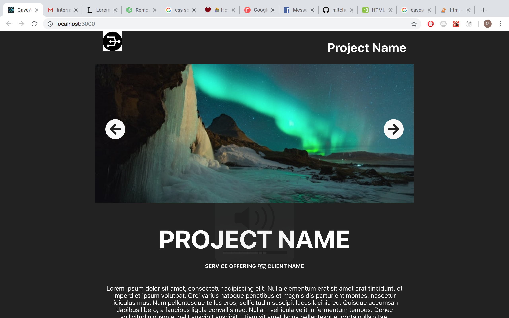
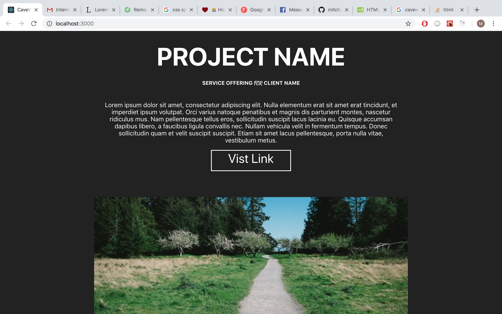
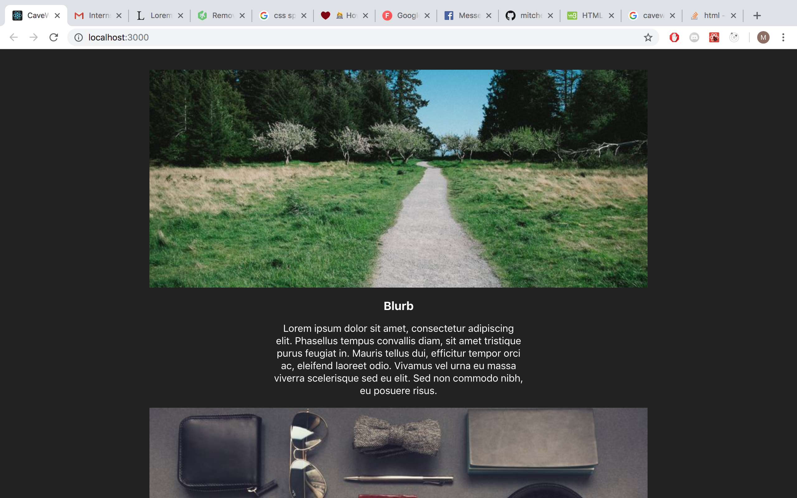
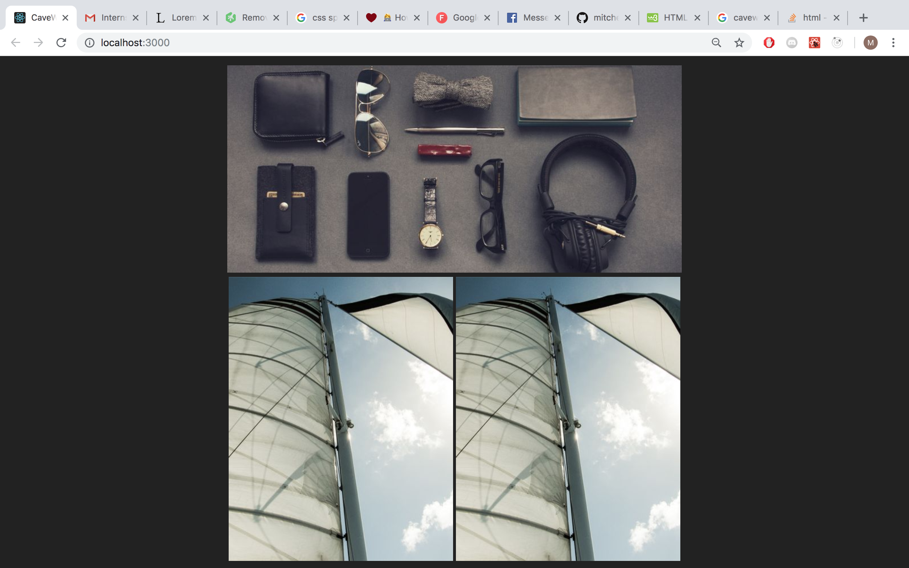
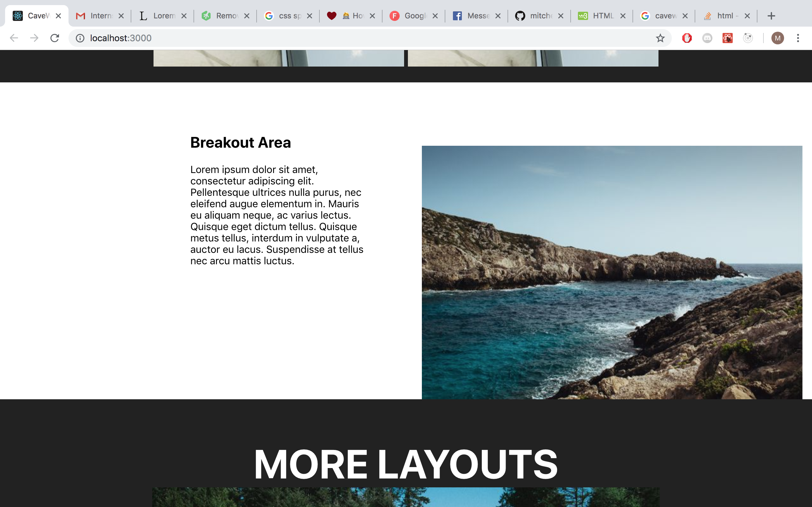
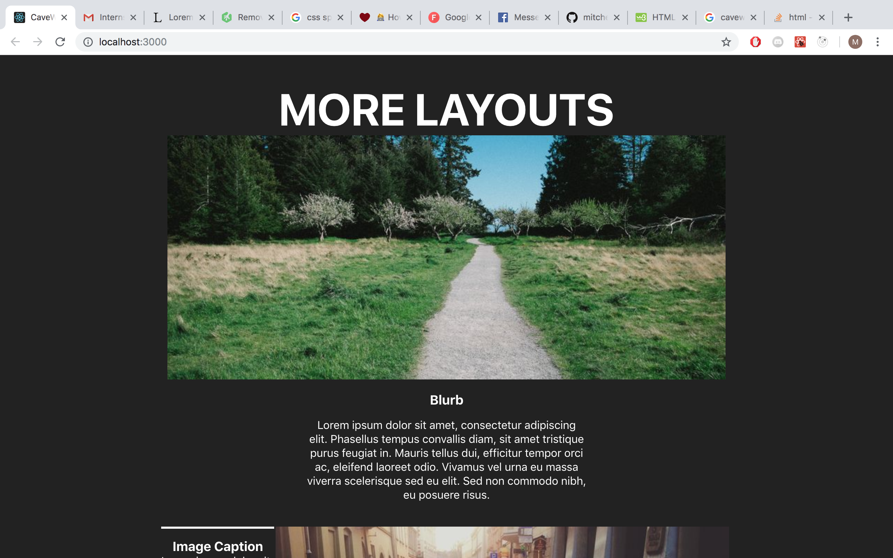
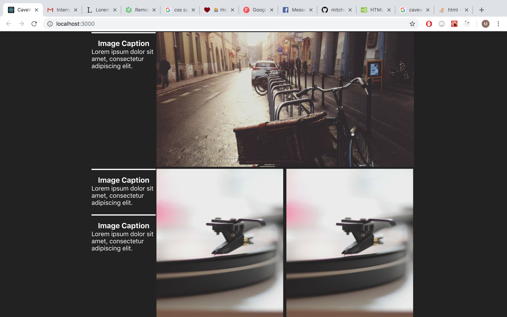
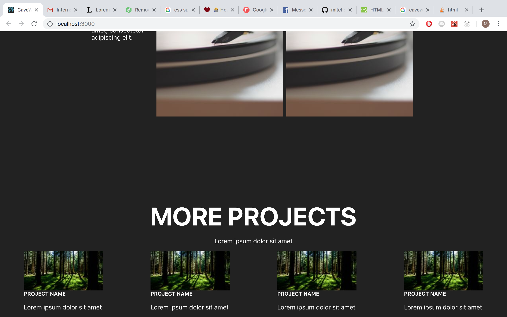

<h1>CAVEWIRE MOCKUP</h1>

To run npm needs to be installed :
<a> install npm</a> after npm is installed cd into the project file run npm i to install the dependencies then npm start will run the app on local host

